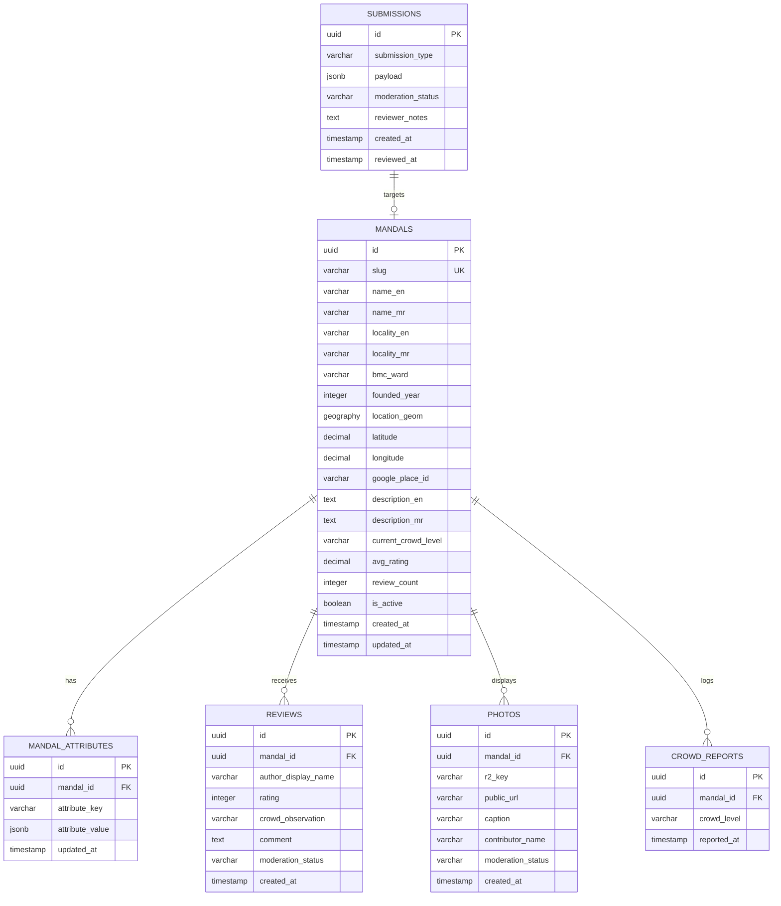

# Database Schema & Data Modeling

## Document Details
- **Project:** BappaMap Mumbai
- **Database Engine:** PostgreSQL 15+ with PostGIS 3.3+ extension
- **Spatial Reference System:** WGS 84 (SRID 4326)
- **Status:** Approved Specification

---

## 1. Schema Design Principles

1. **Native Geospatial Precision:** Coordinates are stored using PostGIS `geography(Point, 4326)`. This allows accurate distance calculations (`ST_Distance`, `ST_DWithin`) in meters without planar distortion.
2. **Extensible Attribute Model:** Future filter parameters (such as `prasad_distributed`, `wheelchair_accessible`, `live_stream_available`, `queue_time_estimate`) are stored in an extensible key-value attribute table and an indexed JSONB column with schema validation. This prevents costly database migrations when adding new community filters.
3. **Strict Moderation State Machine:** All user submissions (edits, reviews, photos) include an immutable audit trail and an explicit moderation status (`pending`, `published`, `flagged`, `rejected`).
4. **Referential Integrity & Constraints:** Foreign keys cascade appropriately; ratings and crowd levels are constrained with strict `CHECK` constraints.

---

## 2. Entity Relationship Diagram



---

## 3. Core Tables Specification

### 3.1 `mandals` Table
Stores the primary directory of verified Ganpati mandals in South Mumbai.

| Column | Type | Constraints | Description |
| :--- | :--- | :--- | :--- |
| `id` | `UUID` | `PRIMARY KEY DEFAULT gen_random_uuid()` | Unique identifier |
| `slug` | `VARCHAR(100)` | `UNIQUE NOT NULL` | URL-safe slug (e.g. `lalbaugcha-raja`) |
| `name_en` | `VARCHAR(255)` | `NOT NULL` | Name in English |
| `name_mr` | `VARCHAR(255)` | `NOT NULL` | Name in Marathi (Devanagari) |
| `locality_en` | `VARCHAR(100)` | `NOT NULL` | Locality in English (e.g. `Lalbaug`) |
| `locality_mr` | `VARCHAR(100)` | `NOT NULL` | Locality in Marathi (e.g. `लालबाग`) |
| `bmc_ward` | `VARCHAR(10)` | `NOT NULL` | BMC Ward (`A`, `B`, `C`, `D`, `E`, `F/South`) |
| `founded_year` | `SMALLINT` | `CHECK (founded_year BETWEEN 1800 AND 2100)` | Year established (e.g. 1893) |
| `location` | `GEOGRAPHY(Point, 4326)` | `NOT NULL` | PostGIS spatial point (Lon, Lat) |
| `latitude` | `NUMERIC(9, 6)` | `NOT NULL` | Latitude coordinate |
| `longitude` | `NUMERIC(9, 6)` | `NOT NULL` | Longitude coordinate |
| `google_place_id` | `VARCHAR(255)` | `NULL` | Optional Google Maps Place ID |
| `description_en` | `TEXT` | `NULL` | Historical/cultural overview (English) |
| `description_mr` | `TEXT` | `NULL` | Historical/cultural overview (Marathi) |
| `current_crowd_level`| `VARCHAR(20)` | `CHECK (current_crowd_level IN ('low', 'moderate', 'heavy', 'very_heavy'))` | Live calculated crowd tier |
| `avg_rating` | `NUMERIC(3, 2)` | `DEFAULT 0.00` | Aggregated rating (1.00 to 5.00) |
| `review_count` | `INTEGER` | `DEFAULT 0` | Total approved reviews |
| `metadata` | `JSONB` | `DEFAULT '{}'::jsonb` | Extensible key-value attributes |
| `is_active` | `BOOLEAN` | `DEFAULT true NOT NULL` | Soft delete / seasonal visibility flag |
| `created_at` | `TIMESTAMPTZ` | `DEFAULT NOW() NOT NULL` | Timestamp created |
| `updated_at` | `TIMESTAMPTZ` | `DEFAULT NOW() NOT NULL` | Timestamp updated |

---

### 3.2 `mandal_attributes` Table (Extensible Filter Architecture)
Allows zero-migration additions of filter parameters (e.g., parking options, wheelchair access, shoe stalls).

```sql
CREATE TABLE mandal_attributes (
    id UUID PRIMARY KEY DEFAULT gen_random_uuid(),
    mandal_id UUID NOT NULL REFERENCES mandals(id) ON DELETE CASCADE,
    attribute_key VARCHAR(50) NOT NULL,
    attribute_value JSONB NOT NULL,
    created_at TIMESTAMPTZ DEFAULT NOW() NOT NULL,
    UNIQUE(mandal_id, attribute_key)
);
```

#### Supported Core Attribute Keys (Initial):
- `parking_nearby`: `{"available": true, "type": "street_paid", "walk_time_mins": 8}`
- `wheelchair_accessible`: `{"accessible": false, "notes": "Steep steps at entrance"}`
- `darshan_types`: `["mukh_darshan", "navas_charan_sparsh"]`
- `nearest_railway_station`: `{"name": "Currey Road", "line": "Central", "distance_km": 0.6}`

---

### 3.3 `reviews` Table
Stores devotee reviews and crowd observations.

| Column | Type | Constraints | Description |
| :--- | :--- | :--- | :--- |
| `id` | `UUID` | `PRIMARY KEY DEFAULT gen_random_uuid()` | Unique review ID |
| `mandal_id` | `UUID` | `NOT NULL REFERENCES mandals(id) ON DELETE CASCADE` | Associated mandal |
| `author_display_name` | `VARCHAR(100)` | `DEFAULT 'Devotee' NOT NULL` | Contributor nickname |
| `rating` | `SMALLINT` | `CHECK (rating BETWEEN 1 AND 5) NOT NULL` | Rating (1 to 5 stars) |
| `crowd_observation` | `VARCHAR(20)` | `CHECK (crowd_observation IN ('low', 'moderate', 'heavy', 'very_heavy'))` | Crowd report at time of visit |
| `comment` | `TEXT` | `CHECK (char_length(comment) <= 1000)` | Review comment |
| `moderation_status` | `VARCHAR(20)` | `DEFAULT 'pending' CHECK (moderation_status IN ('pending', 'published', 'flagged', 'rejected'))` | Quarantine status |
| `created_at` | `TIMESTAMPTZ` | `DEFAULT NOW() NOT NULL` | Created at |

---

### 3.4 `photos` Table
Stores references to devotee-submitted photos hosted on Cloudflare R2.

| Column | Type | Constraints | Description |
| :--- | :--- | :--- | :--- |
| `id` | `UUID` | `PRIMARY KEY DEFAULT gen_random_uuid()` | Unique photo ID |
| `mandal_id` | `UUID` | `NOT NULL REFERENCES mandals(id) ON DELETE CASCADE` | Associated mandal |
| `r2_key` | `VARCHAR(255)` | `NOT NULL UNIQUE` | Storage key in Cloudflare R2 bucket |
| `public_url` | `VARCHAR(500)` | `NOT NULL` | CDN public URL |
| `caption` | `VARCHAR(255)` | `NULL` | Optional caption |
| `contributor_name` | `VARCHAR(100)` | `DEFAULT 'Devotee' NOT NULL` | Name credited |
| `moderation_status` | `VARCHAR(20)` | `DEFAULT 'pending' CHECK (moderation_status IN ('pending', 'published', 'flagged', 'rejected'))` | Quarantine status |
| `created_at` | `TIMESTAMPTZ` | `DEFAULT NOW() NOT NULL` | Created at |

---

### 3.5 `submissions` Table (Quarantine Inbox)
Universal intake for community suggestions (new mandal additions or metadata edits).

```sql
CREATE TABLE submissions (
    id UUID PRIMARY KEY DEFAULT gen_random_uuid(),
    submission_type VARCHAR(50) NOT NULL CHECK (submission_type IN ('new_mandal', 'edit_mandal', 'crowd_update')),
    payload JSONB NOT NULL,
    ip_hash VARCHAR(64) NOT NULL,
    moderation_status VARCHAR(20) DEFAULT 'pending' CHECK (moderation_status IN ('pending', 'published', 'flagged', 'rejected')),
    reviewer_notes TEXT,
    created_at TIMESTAMPTZ DEFAULT NOW() NOT NULL,
    reviewed_at TIMESTAMPTZ
);
```

---

## 4. Indexes & Performance Optimization

```sql
-- Spatial indexing for high-performance geospatial queries
CREATE INDEX idx_mandals_location ON mandals USING GIST (location);

-- Fast lookup by URL slug
CREATE INDEX idx_mandals_slug ON mandals (slug);

-- B-tree indexes for list filtering and sorting
CREATE INDEX idx_mandals_status ON mandals (is_active, current_crowd_level);
CREATE INDEX idx_reviews_mandal_status ON reviews (mandal_id, moderation_status, created_at DESC);
CREATE INDEX idx_photos_mandal_status ON photos (mandal_id, moderation_status, created_at DESC);
CREATE INDEX idx_submissions_status ON submissions (moderation_status, created_at DESC);

-- GIN index for fast JSONB querying on extensible attributes
CREATE INDEX idx_mandal_attributes_gin ON mandals USING GIN (metadata);
```

---

## 5. Seed Strategy & Verification
Seed data will be maintained in `data/seed-mandals.json` and inserted via idempotent database migrations or a seed command (`npm run db:seed`). The database will be seeded with the 12 verified South Mumbai mandals identified during Phase 1.

---

## 6. Document Cross-References
- [02-architecture.md](file:///Users/ranveerdeshmukh/ganpati-mandal-map/docs/02-architecture.md) — System request flow and R2 integration.
- [04-backend-prd.md](file:///Users/ranveerdeshmukh/ganpati-mandal-map/docs/04-backend-prd.md) — API payloads and database queries.
- [07-content-and-data.md](file:///Users/ranveerdeshmukh/ganpati-mandal-map/docs/07-content-and-data.md) — Sourced coordinates and founding details.
- [08-trust-and-safety.md](file:///Users/ranveerdeshmukh/ganpati-mandal-map/docs/08-trust-and-safety.md) — Moderation status transitions.
