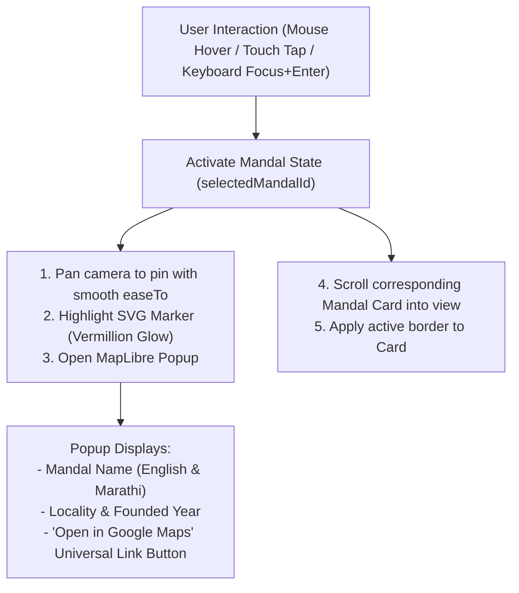

# Frontend Architecture & UI Specification

## Document Details
- **Project:** BappaMap Mumbai
- **Framework:** Next.js (App Router, Static First) with React Islands
- **Styling:** Tailwind CSS with CSS Variables
- **Map Renderer:** MapLibre GL JS (v4.x/5.x)
- **Status:** Approved Specification

---

## 1. Application Routing & Page Structure

The application is structured for instant edge delivery and minimal client bundle overhead:

| Route | Purpose | Rendering Strategy | Key Components |
| :--- | :--- | :--- | :--- |
| `/` | Main interactive view: Map, Filter drawer, Mandal cards | SSG + ISR (300s) with Client Map Island | `MapIsland`, `FilterBar`, `MandalCardList`, `AddReviewModal` |
| `/mandal/[slug]` | Dedicated deep-dive detail page (SEO & direct links) | SSG (pre-rendered for 12 seed mandals) | `MandalHero`, `MandalHistory`, `PhotoGallery`, `ReviewFeed` |
| `/admin` | Maintainer moderation portal | Client-side authenticated | `AdminQueueTable`, `PhotoInspectionModal` |

---

## 2. Interactive Map Behavior Specification

### 2.1 Geographic Bounds & Restrictions
- **Center Coordinate:** `[72.8250, 18.9550]` (Girgaon / Khetwadi centroid)
- **Default Zoom:** `13.5`
- **Zoom Constraints:** `minZoom: 12.0`, `maxZoom: 17.5`
- **Max Bounding Box (`maxBounds`):**
  ```typescript
  export const SOUTH_MUMBAI_BOUNDS: [[number, number], [number, number]] = [
      [72.780000, 18.890000], // Southwest (Colaba coast)
      [72.870000, 19.015000]  // Northeast (Parel / Lalbaug boundary)
  ];
  ```
  *Constraint Enforcement:* Users cannot physically drag, flick, or zoom outside these coordinates. Any attempt to pan beyond snaps back smoothly with dampening.

### 2.2 Geolocation Ban
- `GeolocateControl` is **never instantiated or imported**.
- The UI contains no "Find Me", "Current Location", or GPS icon.
- Automated CI test fails if `navigator.geolocation` is referenced.

### 2.3 Pin & Popup Interaction (Parity Rule)
A pin interaction must render the identical content and trigger the same state transition across all interaction modalities:



#### Universal Google Maps Link Format:
```typescript
export function getGoogleMapsUrl(latitude: number, longitude: number): string {
    return `https://www.google.com/maps/search/?api=1&query=${encodeURIComponent(
        `${latitude},${longitude}`
    )}`;
}
```

---

## 3. Extensible Filter System & State Management

### 3.1 Bidirectional State Synchronization
1. **URL as Single Source of Truth:** Filter parameters live directly in URL search params (e.g. `/?crowd=low,moderate&parking=true&rating=4`).
2. **Filtering List Filters Pins:** When a user toggles "Low Crowd", only mandals matching the criteria remain visible in the card list AND their corresponding pins remain active on the map (unmatched pins drop to 20% opacity or are removed from the active GeoJSON source).
3. **Selecting Card Focuses Pin:** Tapping or clicking a card in the list calls `map.flyTo({ center: [lng, lat], zoom: 15.5 })` and activates its pin popup.

### 3.2 Extensible Filter Architecture
Filter parameters are defined via a declarative config array rather than hardcoded UI:

```typescript
export interface FilterDefinition {
    id: string;
    labelEn: string;
    labelMr: string;
    type: "boolean" | "multiselect" | "range";
    options?: { value: string; labelEn: string; labelMr: string }[];
    matcher: (mandal: MandalItem, activeValue: any) => boolean;
}

export const REGISTERED_FILTERS: FilterDefinition[] = [
    {
        id: "crowd",
        labelEn: "Crowd Level",
        labelMr: "गर्दी",
        type: "multiselect",
        options: [
            { value: "low", labelEn: "Low (< 30m)", labelMr: "कमी" },
            { value: "moderate", labelEn: "Moderate (30m–1h)", labelMr: "मध्यम" },
            { value: "heavy", labelEn: "Heavy (1h–3h)", labelMr: "जास्त" },
            { value: "very_heavy", labelEn: "Very Heavy (3h+)", labelMr: "अतिशय गर्दी" }
        ],
        matcher: (mandal, val) => val.includes(mandal.currentCrowdLevel)
    },
    {
        id: "parking",
        labelEn: "Parking Nearby",
        labelMr: "पार्किंग सोय",
        type: "boolean",
        matcher: (mandal, val) => Boolean(mandal.attributes?.parkingNearby) === val
    },
    {
        id: "min_rating",
        labelEn: "Minimum Rating",
        labelMr: "किमान रेटिंग",
        type: "range",
        matcher: (mandal, val) => mandal.avgRating >= val
    }
];
```

---

## 4. Community Contribution Modals ("Add/Review Mandal")

The main top navigation bar houses a primary CTA button: **"Add/Review Mandal"** (`मंडळ जोडा / अभिप्राय द्या`). Clicking this button opens a modal offering three distinct paths:

```
+--------------------------------------------------------+
|               Community Contribution                   |
|       सहभाग नोंदवा: खालीलपैकी एक पर्याय निवडा        |
|                                                        |
|  [ 1. Add a New Mandal ]   --> Opens Mandal Suggestion |
|  [ 2. Submit a Review  ]   --> Opens Rating & Feedback |
|  [ 3. Upload Photos    ]   --> Opens Image Upload Flow |
|                                                        |
|  Protected by Cloudflare Turnstile | Privacy Assured   |
+--------------------------------------------------------+
```

### Client-Side Image Privacy Pre-flight:
Before any image leaves the client device, an in-memory HTML5 Canvas executes:
1. `ctx.drawImage(img, 0, 0, width, height)` resizing to max 1600px dimension.
2. `canvas.toBlob('image/webp', 0.82)`: Re-encodes the image. This permanently discards all original EXIF metadata, GPS latitude/longitude tags, camera make/model, and creation timestamps.
3. Only the sanitized WebP blob is transmitted to `/api/submissions`.

---

## 5. Accessibility (WCAG 2.2 AA Compliance)

1. **Focus Management:** Every interactive pin marker is an accessible `<button>` element with `tabindex="0"`, explicit `aria-label` (e.g. `aria-label="Lalbaugcha Raja, 1934, Lalbaug"`), and visible high-contrast focus rings (`focus-visible:ring-2 focus-visible:ring-vermillion`).
2. **Keyboard Traversal:** Users can cycle through pins using `Tab` and open details with `Enter` or `Space`.
3. **Contrast Ratio:** All text elements adhere strictly to WCAG AA minimum 4.5:1 for body copy and 3.0:1 for large headers against dark/light backgrounds.
4. **Motion Safety:** All animations respect `@media (prefers-reduced-motion: reduce)`. WebGL shader effects and smooth map panning automatically disable or drop to instant cuts.

---

## 6. Performance Budgets

| Asset Category | Target Budget | Enforcement |
| :--- | :--- | :--- |
| **Initial HTML** | < 30 kB | Static generation in Next.js |
| **Critical CSS** | < 25 kB | Tailwind purge / extraction |
| **Client JS (Excluding Map)** | < 80 kB gzipped | Tree-shaken React components |
| **MapLibre GL JS + Worker** | < 280 kB gzipped | Lazy-loaded on idle / visibility |
| **Web Fonts (Devanagari + Latin)** | < 50 kB | WOFF2 with `unicode-range` subsetting |
| **Largest Contentful Paint (LCP)** | < 2.0s on 4G | Lighthouse CI automated run |
| **Cumulative Layout Shift (CLS)** | < 0.05 | Fixed aspect ratios on map and card slots |

---

## 7. Document Cross-References
- [01-PRD.md](file:///Users/ranveerdeshmukh/ganpati-mandal-map/docs/01-PRD.md) — Product vision and requirements.
- [04-backend-prd.md](file:///Users/ranveerdeshmukh/ganpati-mandal-map/docs/04-backend-prd.md) — Backend API schemas.
- [06-design-system.md](file:///Users/ranveerdeshmukh/ganpati-mandal-map/docs/06-design-system.md) — Visual design tokens and typography.
- [10-testing-and-qa.md](file:///Users/ranveerdeshmukh/ganpati-mandal-map/docs/10-testing-and-qa.md) — Playwright E2E and Axe accessibility tests.
