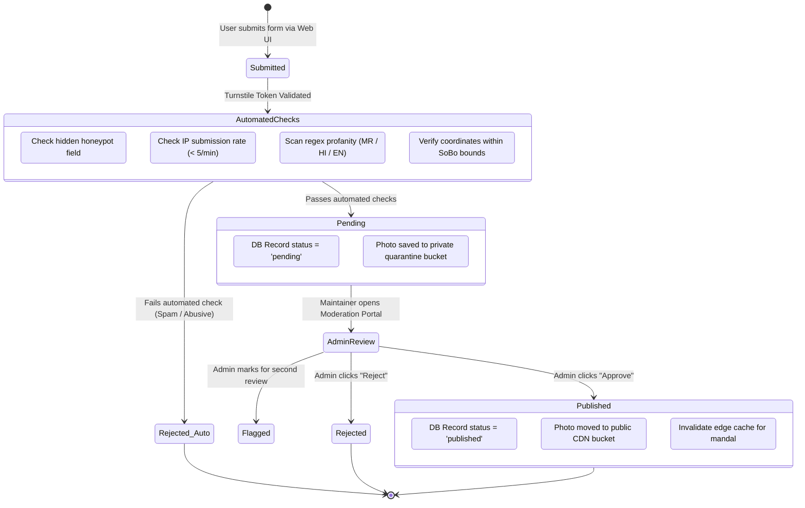

# Trust, Safety & Content Moderation

## Document Details

- **Project:** BappaMap Mumbai
- **System Classification:** Public UGC Platform with Strict Pre-Moderation
- **Moderation Engine:** Dual-Layer (Deterministic Automated Filtering + Admin Review)
- **Status:** Approved Specification

---

## 1. Moderation State Machine

Every piece of user-generated content (reviews, crowd updates, photo uploads, and new mandal suggestions) is quarantined upon submission. No unapproved content ever displays publicly.



---

## 2. Automated Spam Defenses

### 2.1 Bot Protection: Cloudflare Turnstile

- Client submits a dynamic Turnstile challenge token with every form payload.
- Server verifies token with `https://challenges.cloudflare.com/turnstile/v0/siteverify` using the server secret key.
- Requests with invalid or missing tokens fail immediately with HTTP 403 Forbidden.

### 2.2 Client-Side Honeypot

- Forms include an invisible input field: `<input type="text" name="bappa_hp_website" style="display:none" tabindex="-1" autocomplete="off" />`.
- If this field contains any value upon submission, the request is flagged as a bot submission and rejected silently (HTTP 202 returned to deceive the bot, but DB record discarded).

### 2.3 IP Hashing & Privacy-Preserving Rate Limiting

- To enforce rate limits without storing sensitive user IP addresses (satisfying DPDP Act 2023 privacy obligations), the server calculates a one-way salted hash:
    ```typescript
    const ipHash = crypto.createHmac("sha256", process.env.IP_SALT!).update(clientIp).digest("hex");
    ```
- Submissions are limited to **5 requests per 10-minute window per `ipHash`**.

### 2.4 Multi-Language Deterministic Profanity Filter

- Text submissions (reviews and mandal descriptions) are scanned against an open-source tri-lingual regex dictionary covering offensive slurs in **Marathi, Hindi, and English**.
- Matched submissions are automatically marked as `rejected_auto` and discarded.

---

## 3. Image Safety & Privacy Guardrails

### 3.1 Client-Side EXIF & Location Stripping

Before a photograph is uploaded, the devotee's browser re-renders the image to an HTML5 canvas and re-encodes it as WebP:

- **Zero EXIF Retention:** Strips GPS latitude/longitude, altitude, camera serial numbers, and device timestamps.
- **Dimensional Normalization:** Resizes images to a maximum of 1600px along the longest edge to conserve storage and bandwidth.
- **Maximum File Size:** Enforced at 5 MB client-side and server-side.

### 3.2 Guidelines on Identifiable People & Privacy

- **Acceptable Imagery:** Wide-angle shots of pandal decor, artistic facades, lighting displays, floral arrangements, and general darshan crowds where individuals are not singled out.
- **Unacceptable Imagery:** Close-up portraits or invasive selfies of private citizens without explicit consent; children; inappropriate attire; or commercial advertisements.
- **Moderator Training:** Admins reject any photograph featuring a prominent individual face or personal dispute.

---

## 4. Takedown & Grievance Protocol (IT Rules 2021 Alignment)

To comply with the Information Technology (Intermediary Guidelines and Digital Media Ethics Code) Rules, 2021 (Rule 3):

1. **Designated Grievance Contact:**
    - The footer of every page displays an official contact link: `grievance@bappamap.in`.
    - Contact form allows copyright holders, mandal trust representatives, or citizens to report infringing or offensive content.
2. **Statutory Response Timelines:**
    - **Acknowledgment:** Automated and logged within **24 hours**.
    - **Resolution / Removal:** Action taken within **36 hours** of receiving actual knowledge or court/government order.
    - **Emergency Privacy Violations:** Content depicting identity fraud or privacy breaches removed within **24 hours**.
3. **Audit Trail:**
    - Every moderation decision (approve, reject, takedown) records the admin user ID, timestamp, and review notes in the `submissions` audit log.

---

## 5. Document Cross-References

- [01-PRD.md](file:///Users/ranveerdeshmukh/ganpati-mandal-map/docs/01-PRD.md) — Product vision and non-goals.
- [02-architecture.md](file:///Users/ranveerdeshmukh/ganpati-mandal-map/docs/02-architecture.md) — R2 quarantine bucket architecture.
- [04-backend-prd.md](file:///Users/ranveerdeshmukh/ganpati-mandal-map/docs/04-backend-prd.md) — Admin moderation endpoints.
- [09-security-and-privacy.md](file:///Users/ranveerdeshmukh/ganpati-mandal-map/docs/09-security-and-privacy.md) — Threat model and legal checklist.
