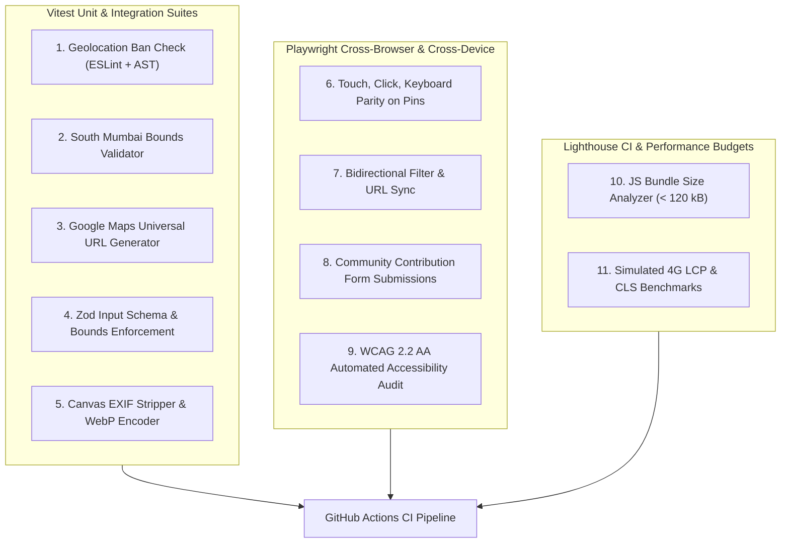

# Testing Strategy & Quality Assurance Protocol

## Document Details
- **Project:** BappaMap Mumbai
- **Test Frameworks:** Vitest (Unit & Integration), Playwright (E2E & Accessibility), Axe-core
- **Coverage Target:** Minimum 80% overall; 100% on security, bounds, and moderation boundaries
- **Status:** Approved Specification

---

## 1. Testing Philosophy & Protocols

Our quality assurance protocols adhere strictly to engineering best practices:
1. **Test-First Discipline (Red-Green-Refactor):** Minimal failing tests must be written first for all features, API endpoints, and bug fixes before implementation.
2. **Behavior-Driven Testing (BDD):** Tests are structured using BDD `describe` and `it` suites, validating contracts, inputs, outputs, and user journeys rather than fragile private implementation details.
3. **Deterministic Execution:** Zero reliance on system clocks, unseeded random values, live network calls, or test execution order. External APIs (Cloudflare Turnstile, R2, Supabase) are mocked deterministically in test environments.
4. **Proof of Verification:** No feature is declared complete without executing the test runner and verifying zero failures.

---

## 2. Test Suite Architecture



---

## 3. Critical Path Test Specifications

### 3.1 Automated Geolocation Ban Enforcement
To guarantee zero location access, three independent automated checks are enforced:

```typescript
// tests/unit/security/geolocation-ban.test.ts
import { describe, it, expect } from "vitest";
import * as fs from "fs";
import * as path from "path";

describe("Strict Geolocation Ban Enforcement", () => {
    it("should ensure no source file contains references to navigator.geolocation", () => {
        const srcDir = path.resolve(__dirname, "../../../src");
        const files = getAllFiles(srcDir);

        for (const file of files) {
            const content = fs.readFileSync(file, "utf-8");
            expect(content).not.toContain("navigator.geolocation");
            expect(content).not.toContain("getCurrentPosition");
            expect(content).not.toContain("watchPosition");
            expect(content).not.toContain("GeolocateControl");
        }
    });
});
```

### 3.2 South Mumbai Bounding Box Enforcement
```typescript
// tests/unit/geo/bounds.test.ts
import { describe, it, expect } from "vitest";
import { isWithinSouthMumbai, SOUTH_MUMBAI_BOUNDS } from "@/lib/geo/bounds";

describe("South Mumbai Geographic Bounds", () => {
    it("should accept verified coordinates within South Mumbai", () => {
        // Keshavji Naik Chawl (Girgaon)
        expect(isWithinSouthMumbai(18.956710, 72.821420)).toBe(true);
        // Lalbaugcha Raja (Lalbaug)
        expect(isWithinSouthMumbai(18.990520, 72.836410)).toBe(true);
        // Fort Vibhag (Fort / CSMT)
        expect(isWithinSouthMumbai(18.939820, 72.835410)).toBe(true);
    });

    it("should reject coordinates outside South Mumbai", () => {
        // Andheri (Suburbs)
        expect(isWithinSouthMumbai(19.1136, 72.8697)).toBe(false);
        // Thane
        expect(isWithinSouthMumbai(19.2183, 72.9781)).toBe(false);
        // Sea / International coordinates
        expect(isWithinSouthMumbai(0.0, 0.0)).toBe(false);
    });
});
```

### 3.3 Google Maps Deep Link Verification
```typescript
// tests/unit/geo/google-maps-url.test.ts
import { describe, it, expect } from "vitest";
import { getGoogleMapsUrl } from "@/lib/geo/google-maps";

describe("Google Maps Universal Deep Link Generation", () => {
    it("should generate the exact official cross-platform URL without API key", () => {
        const url = getGoogleMapsUrl(18.990520, 72.836410);
        expect(url).toBe("https://www.google.com/maps/search/?api=1&query=18.99052%2C72.83641");
    });
});
```

### 3.4 Pin Interaction Parity Test (Touch, Keyboard, Hover)
```typescript
// tests/e2e/pin-interaction-parity.spec.ts
import { test, expect } from "@playwright/test";

test.describe("Mandal Pin Interaction Parity", () => {
    test("keyboard focus and Enter displays identical popup and link as click", async ({ page }) => {
        await page.goto("/");
        const pinButton = page.locator('button[data-testid="mandal-pin-lalbaugcha-raja"]');
        
        // Keyboard navigation
        await pinButton.focus();
        await page.keyboard.press("Enter");

        const popup = page.locator('[data-testid="mandal-popup"]');
        await expect(popup).toBeVisible();
        await expect(popup).toContainText("Lalbaugcha Raja");
        await expect(popup).toContainText("लालबागचा राजा");
        
        const gmapsLink = popup.locator('a[data-testid="google-maps-btn"]');
        await expect(gmapsLink).toHaveAttribute(
            "href",
            "https://www.google.com/maps/search/?api=1&query=18.99052%2C72.83641"
        );
    });
});
```

---

## 4. Accessibility Testing (WCAG 2.2 AA)

Automated via Playwright and `@axe-core/playwright`:
- Every page is audited for color contrast, landmark roles, missing `alt` or `aria-label` attributes, and keyboard traps.
- Zero accessibility violations are permitted in CI.

---

## 5. Device Matrix & Viewport Validation

Playwright executes all E2E tests against three standard responsive viewports:
1. **Mobile (Default):** iPhone 14 / Pixel 7 (375px × 667px and 390px × 844px)
2. **Tablet:** iPad Mini / Air (768px × 1024px)
3. **Desktop:** Standard Laptop (1280px × 800px and 1440px × 900px)

---

## 6. Document Cross-References
- [01-PRD.md](file:///Users/ranveerdeshmukh/ganpati-mandal-map/docs/01-PRD.md) — Product success metrics.
- [05-frontend-prd.md](file:///Users/ranveerdeshmukh/ganpati-mandal-map/docs/05-frontend-prd.md) — Pin interaction and filter specifications.
- [09-security-and-privacy.md](file:///Users/ranveerdeshmukh/ganpati-mandal-map/docs/09-security-and-privacy.md) — Security boundaries and privacy guarantees.
- [11-deployment-and-ops.md](file:///Users/ranveerdeshmukh/ganpati-mandal-map/docs/11-deployment-and-ops.md) — CI/CD execution pipeline.
