# Deployment, Infrastructure & Operations Protocol

## Document Details
- **Project:** BappaMap Mumbai
- **Edge Deployment:** Cloudflare Pages / Workers
- **Database Operations:** Supabase PostgreSQL (Managed)
- **CI/CD Platform:** GitHub Actions
- **Status:** Approved Specification

---

## 1. CI/CD Pipeline Architecture

All code changes must pass through a strict automated GitHub Actions pipeline before merging into `main`.

```mermaid
flowchart LR
    Push["Git Push / PR Opened"] --> LintCheck["ESLint & Prettier Format"]
    LintCheck --> TypeCheck["TypeScript Compiler (tsc --noEmit)"]
    TypeCheck --> SecAudit["Security Audit & Geolocation Ban Check"]
    SecAudit --> UnitTests["Vitest Suite (>= 80% Coverage)"]
    UnitTests --> BuildStep["Next.js Production Build"]
    BuildStep --> E2ETests["Playwright E2E & Axe Accessibility"]
    E2ETests --> DeployStaging["Cloudflare Pages Preview Deployment"]
    DeployStaging --> Merge["Merge to main"]
    Merge --> DeployProd["Cloudflare Pages Production Deployment"]
```



---

## 2. GitHub Actions Workflow Configuration

```yaml
# .github/workflows/ci.yml
name: CI / Verification Pipeline

on:
  push:
    branches: [main]
  pull_request:
    branches: [main]

jobs:
  verify:
    runs-on: ubuntu-latest
    steps:
      - name: Checkout code
        uses: actions/checkout@v4

      - name: Setup Node.js 20
        uses: actions/setup-node@v4
        with:
          node-version: 20
          cache: 'npm'

      - name: Install dependencies
        run: npm ci

      - name: Verify Formatting & Lint
        run: |
          npm run lint
          npm run format:check

      - name: Type Check
        run: npm run typecheck

      - name: Execute Geolocation & Security Guardrails
        run: npm run test:security

      - name: Run Unit & Integration Tests (TDD)
        run: npm run test:unit -- --coverage

      - name: Build Production Bundle
        run: npm run build

      - name: Install Playwright Browsers
        run: npx playwright install --with-deps chromium

      - name: Run E2E & Accessibility Tests
        run: npm run test:e2e
```

---

## 3. Database Operations & Backup Strategy

1. **Automated Nightly Backups:** Managed via Supabase Automated Backups (retained for 7 days on Free/Pro tiers).
2. **Pre-Festival Logical Dump Drill:** 2 weeks prior to Ganesh Chaturthi, an automated logical snapshot is executed and verified:
   ```bash
   pg_dump -h $DB_HOST -U postgres -d postgres --clean --if-exists > backups/bappamap_prefestival_snapshot.sql
   ```
3. **Point-In-Time Recovery (PITR):** Available on production upgrade if transaction-level rollback is required during peak festival days.
4. **Idempotent Migrations:** All schema changes are packaged as sequentially numbered SQL files (`migrations/0001_...`, `migrations/0002_...`) and executed using a migration runner that tracks executed versions in a `_migrations` table.

---

## 4. Observability, Monitoring & Alerts

### 4.1 Error Tracking: Sentry
- Sentry initialized in `sentry.client.config.ts` and `sentry.server.config.ts`.
- **Developer Plan Limit Hygiene:** Free tier includes 5,000 errors/month. During peak traffic (Ganeshotsav 10-day period), transaction sampling is tuned:
  ```typescript
  tracesSampleRate: process.env.NODE_ENV === "production" ? 0.05 : 1.0,
  ```
- **Alert Trigger:** Immediate notification to developer email when 50+ errors occur within a 5-minute rolling window.

### 4.2 Traffic & Performance: Cloudflare Web Analytics
- Lightweight, cookieless, privacy-preserving beacon.
- Monitors:
  - Real-time page view spikes across Mumbai edge colos.
  - Largest Contentful Paint (LCP) and Cumulative Layout Shift (CLS).
  - HTTP 5xx error rate from edge workers.

---

## 5. Incident Response Protocol (Festival Week Readiness)

| Incident Scenario | Detection Indicator | Immediate Mitigation | Resolution SLA |
| :--- | :--- | :--- | :--- |
| **Spam / Abusive Submissions Flood** | 100+ submissions queued in pending within 10 minutes. | Enable Cloudflare Turnstile "Managed Challenge" mode; throttle write route to 1 req/min per IP. | < 15 minutes |
| **Database Connection Exhaustion** | HTTP 500 errors on API routes; connection timeout errors. | Switch Supabase pooler mode from Session to Transaction; increase Cloudflare edge cache TTL on `/api/mandals` to 15 minutes. | < 10 minutes |
| **Map Tile Rate Limit (if external)** | Map fails to render vector tiles; 429 errors in console. | Activate fallback vector tile source (switch from OpenFreeMap to pre-built PMTiles archive on Cloudflare R2). | < 5 minutes |
| **Vandalized or Tampered Coordinates** | Devotee report via grievance contact. | Admin immediately marks mandal record as inactive or resets coordinates from version-controlled `seed-mandals.json`. | < 30 minutes |

---

## 6. Document Cross-References
- [02-architecture.md](file:///Users/ranveerdeshmukh/ganpati-mandal-map/docs/02-architecture.md) — System design and request flow.
- [04-backend-prd.md](file:///Users/ranveerdeshmukh/ganpati-mandal-map/docs/04-backend-prd.md) — API contract and background workers.
- [09-security-and-privacy.md](file:///Users/ranveerdeshmukh/ganpati-mandal-map/docs/09-security-and-privacy.md) — Secrets and threat modeling.
- [10-testing-and-qa.md](file:///Users/ranveerdeshmukh/ganpati-mandal-map/docs/10-testing-and-qa.md) — Automated CI test gates.
