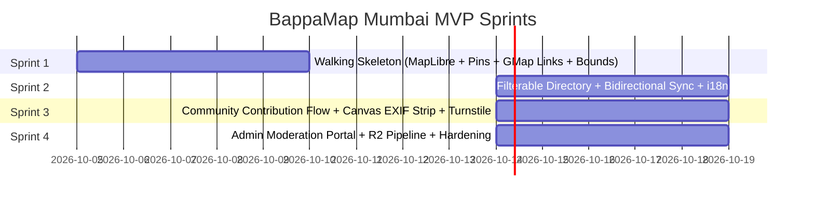

# Sprint Plan: MVP Delivery (Sprints 1 to 4)

## Document Details

- **Project:** BappaMap Mumbai
- **Target Release:** MVP v1.0
- **Development Protocol:** TDD / BDD, Strict Conventional Commits, Zero AI Attribution
- **Status:** Approved Sprint Specifications (Gate 3 Ready)

---

## Sprint Overview & Roadmap Alignment

---

## Sprint 1: The Walking Skeleton

### Goal

Deliver a functional, deployed walking skeleton: interactive South Mumbai map bounded strictly to Colaba–Lalbaug, rendered with custom basalt styling, displaying verified launch pins, accessible popups, universal Google Maps navigation links, and automated geolocation ban enforcement.

### In-Scope

1. Project foundation: Next.js 15, TypeScript, Tailwind CSS, Lucide React, Vitest, Playwright.
2. Geolocation ban enforcement: Automated AST test, ESLint restriction rule, and CI gate.
3. MapLibre GL JS integration with OpenFreeMap vector tiles.
4. Strict bounds enforcement (`[72.7800, 18.8900]` to `[72.8700, 19.0150]`) and zoom limits (`12.0` to `17.5`).
5. Custom dark basalt map style (no default OSM/Mapbox look).
6. 12 verified seed mandals loaded from `data/seed-mandals.json`.
7. Accessible pin markers with touch, click, hover, and keyboard parity (`Tab` + `Enter`).
8. Pin popup rendering English + Marathi names, locality, and official Google Maps deep link (`https://www.google.com/maps/search/?api=1&query={lat}%2C{lng}`).

### Out-of-Scope

- Filter bar and card directory (Sprint 2).
- Community submission forms and upload modals (Sprint 3).
- Admin authentication and moderation portal (Sprint 4).

### Acceptance Criteria

- [ ] Attempting to call `navigator.geolocation` in any client file triggers a failing test and build error.
- [ ] Map camera cannot be panned outside the South Mumbai bounding box.
- [ ] Pressing `Tab` cycles through mandal pins; pressing `Enter` opens the popup.
- [ ] Popup displays authentic names in both English and Marathi.
- [ ] Clicking "Open in Google Maps" links to `https://www.google.com/maps/search/?api=1&query=${lat}%2C${lng}` in a new tab with `rel="noopener noreferrer"`.
- [ ] Initial bundle size (excluding map chunk) is under 80 kB gzipped.
- [ ] All unit and Playwright E2E tests pass cleanly.

### Required Docs to Load

- @[01-PRD.md](docs/01-PRD.md)
- @[05-frontend-prd.md](docs/05-frontend-prd.md)
- @[06-design-system.md](docs/06-design-system.md)
- @[07-content-and-data.md](docs/07-content-and-data.md)
- @[10-testing-and-qa.md](docs/10-testing-and-qa.md)

---

## Sprint 2: Extensible Filterable Directory & Dual-Sync

### Goal

Implement the responsive mandal card directory below the map with real-time bidirectional synchronization, URL search param persistence, extensible filter architecture, and bilingual language switching.

### In-Scope

1. Responsive mandal cards displaying founding year, locality, crowd indicator badge, and star rating.
2. Extensible filter engine supporting crowd level (`low`, `moderate`, `heavy`, `very_heavy`), parking nearby, and minimum rating.
3. Bidirectional state sync:
    - Filtering the card list removes or dims unmatched map pins.
    - Selecting a card triggers smooth `map.flyTo` and opens the corresponding pin popup.
4. URL search parameter persistence (`/?crowd=low&parking=true&lang=mr`).
5. Bilingual toggle (English / Marathi) in the header with persistent `localStorage` preference.
6. Cultural typography pairing: Mukta and Tiro Devanagari Marathi with Plus Jakarta Sans.

### Out-of-Scope

- User submissions and image uploads (Sprint 3).
- Live crowd decay background cron (Sprint 4).

### Acceptance Criteria

- [ ] Toggling filters updates URL query parameters without reloading the page.
- [ ] Sharing a URL with filter params restores the exact filtered card list and map pins.
- [ ] Clicking a mandal card centers the map on the pin with smooth animation.
- [ ] Language toggle instantly switches all UI labels and mandal names between English and Marathi.
- [ ] WCAG 2.2 AA accessibility audit passes with zero violations via Playwright Axe.

### Required Docs to Load

- @[03-database-schema.md](docs/03-database-schema.md)
- @[05-frontend-prd.md](docs/05-frontend-prd.md)
- @[06-design-system.md](docs/06-design-system.md)

---

## Sprint 3: Community Contribution Flow & Privacy Pre-Flight

### Goal

Build the community contribution modal workflows ("Add/Review Mandal"), incorporating client-side in-browser EXIF/GPS stripping, Cloudflare Turnstile bot verification, and secure API ingestion into the quarantine database.

### In-Scope

1. "Add/Review Mandal" header CTA opening the 3-option flow:
    - Option 1: Suggest a New Mandal (name, locality, coordinates, description).
    - Option 2: Submit Review & Live Crowd Observation.
    - Option 3: Upload Mandal Photos.
2. In-browser HTML5 Canvas EXIF/GPS stripping engine with WebP re-encoding (< 1600px, 0.82 quality).
3. Cloudflare Turnstile invisible widget integration.
4. Serverless API route `/api/submissions` with Zod schema validation and RFC 7807 problem details.
5. Storage of pending submissions in the PostgreSQL database with `moderation_status = 'pending'`.
6. Storage of unvetted images in the private Cloudflare R2 quarantine bucket.
7. User feedback: Instant `202 Accepted` confirmation with pending moderation notice.

### Out-of-Scope

- Admin approval dashboard (Sprint 4).
- Automatic publishing without review.

### Acceptance Criteria

- [ ] Uploading a photo with GPS tags yields an uploaded WebP blob with 0% EXIF or location metadata.
- [ ] Submissions without a valid Turnstile token are rejected with HTTP 403.
- [ ] Submissions with coordinates outside South Mumbai are rejected with HTTP 400 and RFC 7807 error details.
- [ ] All submitted content is saved with `moderation_status = 'pending'` and does not appear on the live public map.

### Required Docs to Load

- @[04-backend-prd.md](docs/04-backend-prd.md)
- @[08-trust-and-safety.md](docs/08-trust-and-safety.md)
- @[09-security-and-privacy.md](docs/09-security-and-privacy.md)

---

## Sprint 4: Pre-Moderation Dashboard & Production Hardening

### Goal

Deliver the authenticated moderation portal for maintainers, the R2 photo promotion pipeline, edge caching policies, and end-to-end security and load verification.

### In-Scope

1. Authenticated `/admin` dashboard with Supabase Auth (magic link / email OTP).
2. Moderation queue table: preview pending reviews, inspect sanitized photos, and review mandal suggestions.
3. Single-click actions: Approve, Reject, Flag.
4. Approval action triggers:
    - Photo promotion from `bappamap-quarantine` to public `bappamap-public` bucket.
    - DB record status update to `published`.
    - Cloudflare cache tag purge for mandals collection.
5. Sliding-window crowd decay calculation job (aggregating crowd reports from the last 2 hours).
6. Security and performance audit: Lighthouse CI (> 95 score), CSP headers, rate-limiting stress test.

### Acceptance Criteria

- [ ] Unauthenticated users are redirected from `/admin` to login.
- [ ] Approving a pending review causes it to appear on the public mandal detail view immediately.
- [ ] Rejecting a submission removes it from the queue and marks it as rejected in the audit log.
- [ ] Lighthouse performance score exceeds 95 on simulated mobile 4G.
- [ ] Edge response time for `/api/mandals` is under 50ms from Mumbai edge nodes.

### Required Docs to Load

- @[02-architecture.md](docs/02-architecture.md)
- @[04-backend-prd.md](docs/04-backend-prd.md)
- @[08-trust-and-safety.md](docs/08-trust-and-safety.md)
- @[11-deployment-and-ops.md](docs/11-deployment-and-ops.md)
