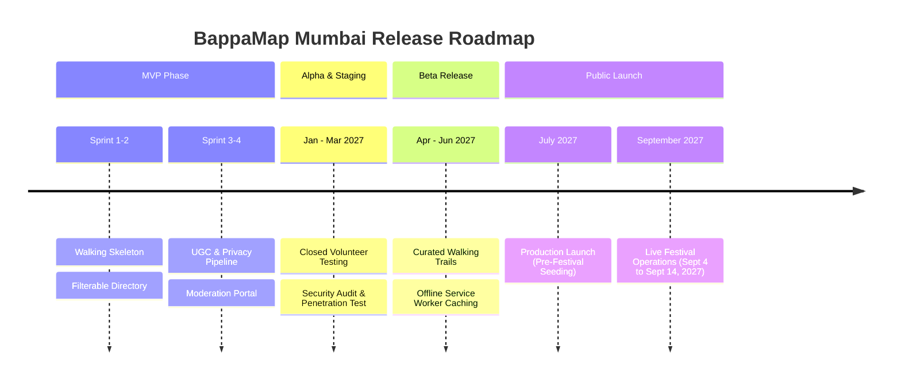

# Product Roadmap & Post-MVP Evolution

## Document Details
- **Project:** BappaMap Mumbai
- **Target Launch Window:** July 2027 (Pre-Ganeshotsav 2027 window)
- **Lifecycle Scope:** Post-MVP through Annual Production Maintenance
- **Status:** Approved Roadmap

---

## 1. Release Timeline & Milestones

---

## 2. Post-MVP Feature Tracks

### Track A: Live Crowd Status Meter with Dynamic Time Decay
- **Problem:** Devotees need to know if queue times are surging right now, not what they were 5 hours ago.
- **Solution:** A sliding-window exponential decay algorithm that weights user crowd reports over a 120-minute half-life.
- **Key Metrics:** Crowd status displays as `Low (< 30m)`, `Moderate (30m–1h)`, `Heavy (1h–3h)`, `Very Heavy (3h+)` with an indicator reading *"Updated 12 mins ago from 28 reports"*.

### Track B: Curated Walking Trails (*Darshan Parikrama*)
- **Problem:** Devotees hopping between 5–8 pandals in an evening often walk inefficient, congested routes.
- **Solution:** Curated pedestrian trails overlaid on the custom map:
  1. **Girgaon Heritage Trail:** Keshavji Naik Chawl -> Nikadwari Lane (Girgaoncha Raja) -> Bal Gopal Mitra Mandal.
  2. **Khetwadi Corridor:** 1st Lane to 14th Lane corridor with street-by-street pedestrian walkthroughs.
  3. **Lalbaug Circuit:** Lalbaugcha Raja -> Mumbaicha Raja (Ganesh Galli) -> Tejukaya -> Chinchpoklicha Chintamani.
- **Implementation:** Stored as GeoJSON linestrings rendered on top of the vector basemap with turn notes avoiding police barricade bottlenecks.

### Track C: Dead-Zone Offline Resilience (Progressive Web App)
- **Problem:** Cellular networks in Lalbaug and Girgaon frequently suffer total data blackouts between 8:00 PM and midnight due to extreme crowd density.
- **Solution:**
  - Full PWA manifest with Service Worker caching.
  - One-click button: *"Download South Mumbai Map for Offline Use"* (~12 MB).
  - Caches the South Mumbai `.pmtiles` archive and mandal metadata in browser `CacheStorage` / `IndexedDB`.
  - The map remains fully pan-able, zoom-able, and searchable even in airplane mode.

### Track D: Geographic Expansion (Phase 2 & Beyond)
- **Central Mumbai Precinct:** Expansion to Dadar, Prabhadevi (Siddhivinayak area), and Matunga (GSB Seva Mandal).
- **Suburban Circuits:** Andheri (Andhericha Raja), Bandra, and Chembur (Sahyadri Krida Mandal).
- **Enforcement:** Each geographic expansion is isolated into regional boundary presets to preserve quick map rendering and low initial payload.

### Track E: Oral History & Audio Snippets
- Multilingual 60-second audio snippets detailing the 1893 founding of Keshavji Naik Chawl, Lokmanya Tilak's speeches, mill-worker heritage of Lalbaug, and traditional Shadu clay craftsmanship.
- Audio compressed into ultra-low-bitrate Opus files (< 300 kB per story).

---

## 3. Annual Operational Rhythm

| Period | Operational Focus |
| :--- | :--- |
| **July (T - 8 Weeks)** | Launch production environment with refreshed seed data; verify municipal ward barricades. |
| **August (T - 4 Weeks)** | Conduct load testing (100k simulated requests) and backup restore drills. |
| **Festival Week (Sept 4–14, 2027)** | Active maintainer moderation coverage (6:00 PM to 2:00 AM daily); real-time crowd queue monitoring. |
| **October (T + 2 Weeks)** | Post-festival archival; export community photos to cold storage; publish transparent community report. |
